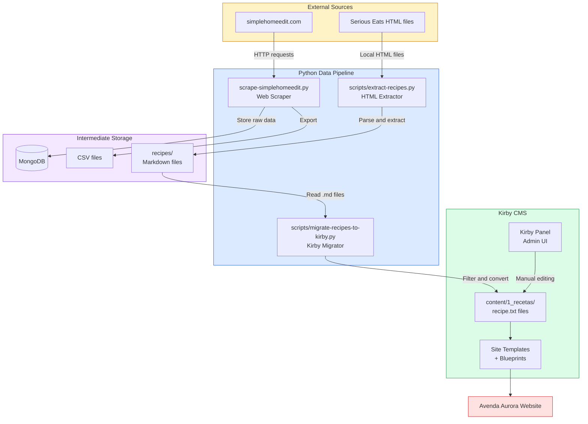
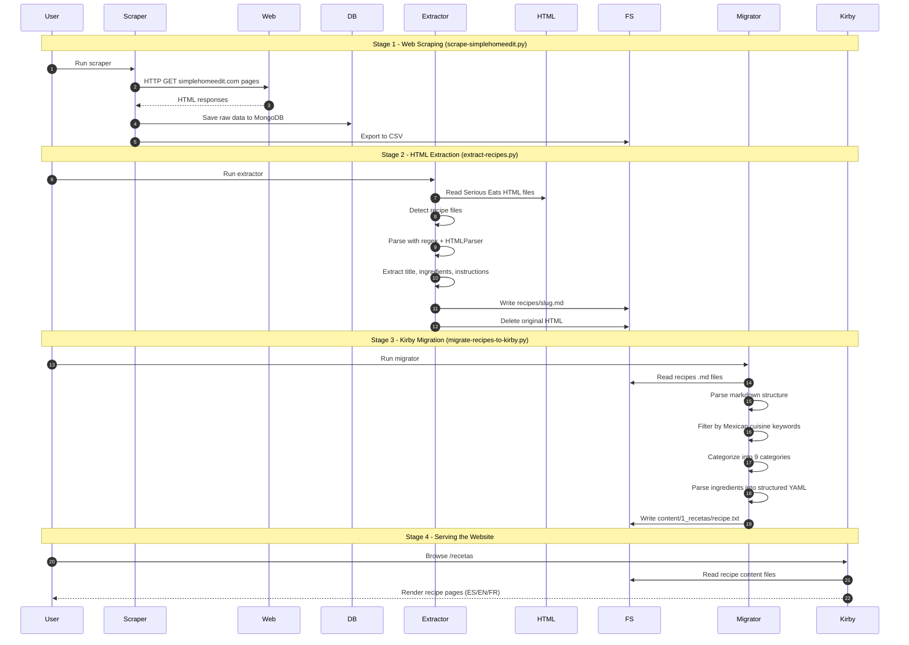

# Aurora - Project Architecture

A multilingual cuisine blog and shop built on **Kirby CMS**, featuring an automated recipe pipeline that scrapes, extracts, and imports recipes from external sources.

**Stack:** Python (data pipeline) + Kirby CMS (PHP, file-based) + Tailwind CSS
**Languages:** Spanish (default), English, French

---

## System Architecture



---

## Pipeline Sequence Diagram



---

## Component Details

### Stage 1: Web Scraper (`scrape-simplehomeedit.py`)

| | |
|---|---|
| **Source** | simplehomeedit.com |
| **Output** | MongoDB collection + CSV export |
| **Purpose** | Scrape recipe content from external website for later processing |

### Stage 2: HTML Extractor (`scripts/extract-recipes.py`)

| | |
|---|---|
| **Input** | `www.seriouseats.com_*.html` files in project root |
| **Output** | `recipes/{slug}.md` Markdown files |
| **Key logic** | Uses `HTMLParser` + regex fallback to extract title, description, author, tags, image URL, prep/cook/total time, servings, ingredients, and instructions |
| **Filtering** | Skips non-recipe pages (articles, roundups) by checking for ingredient/instruction markers |

### Stage 3: Kirby Migrator (`scripts/migrate-recipes-to-kirby.py`)

| | |
|---|---|
| **Input** | `recipes/*.md` |
| **Output** | `content/1_recetas/{slug}/recipe.txt` (Kirby content format) |
| **Key logic** | Parses Markdown into structured fields, filters for Mexican cuisine using 60+ keywords (taco, mole, pozole...), auto-categorizes into 9 categories (antojitos, platos-fuertes, sopas-caldos, salsas, mariscos, desayunos, postres, bebidas, vegetarianos), and generates structured YAML for ingredients |

### Stage 4: Kirby CMS

| | |
|---|---|
| **Content** | File-based (`content/` directory, no database) |
| **Admin** | Kirby Panel at `/panel` |
| **Features** | Multilingual (ES/EN/FR), recipe categories, ingredient encyclopedia, store-linked ingredient kits, e-commerce via Snipcart |

---

## Directory Structure

```
aurora-blog/
├── scripts/
│   ├── extract-recipes.py        # Stage 2: HTML → Markdown
│   └── migrate-recipes-to-kirby.py  # Stage 3: Markdown → Kirby
├── scrape-simplehomeedit.py      # Stage 1: Web → MongoDB/CSV
├── recipes/                      # Intermediate .md files
├── content/
│   └── 1_recetas/                # Kirby recipe content
│       └── {recipe-slug}/
│           └── recipe.txt
├── site/
│   ├── blueprints/               # Kirby field definitions
│   └── templates/                # Kirby page templates
├── kirby/                        # Kirby core
└── architecture-plan.md          # Full project spec
```
